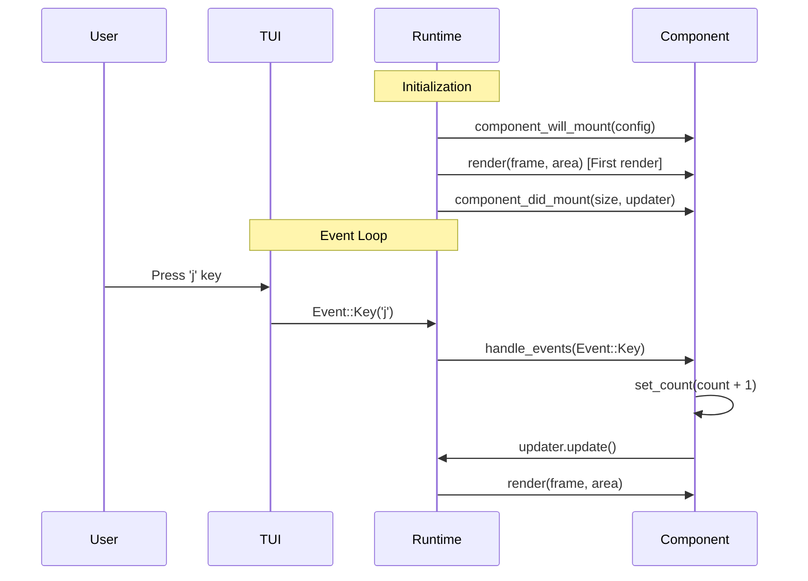

# yap - yat another proxy.

## Component Lifecycle

This framework implements a React-like component lifecycle. Components go through three main phases:

### Lifecycle Overview

```
Initialization → Event Loop → Cleanup
     ↓              ↓            ↓
  will_mount    handle_events  (exit)
    render         render
  did_mount
```

### Lifecycle Methods

```rust
pub trait Component {
    // 1. Called once before first render - initialize state, setup children
    fn component_will_mount(&mut self, config: Config) -> Result<()>
    
    // 2. First render happens automatically here
    
    // 3. Called once after first render - store Updater for triggering re-renders
    fn component_did_mount(&mut self, area: Size, updater: Updater) -> Result<()>
    
    // 4. Called on user input - return Action to trigger state changes
    fn handle_events(&mut self, event: Option<Event>) -> Result<Option<Action>>
    
    // 5. Called when state changes or window resizes (REQUIRED)
    fn render(&mut self, frame: &mut Frame, area: Rect) -> Result<()>
}
```

### Simple Example

```rust
pub struct Counter {
    count: i32,
    updater: Option<Updater>,
}

impl Counter {
    // setState-like method to update state and trigger re-render
    fn set_count(&mut self, new_count: i32) {
        self.count = new_count;
        if let Some(updater) = &self.updater {
            updater.update(); // Trigger re-render
        }
    }
}

impl Component for Counter {
    // 1. Initialize state
    fn component_will_mount(&mut self, _config: Config) -> Result<()> {
        self.count = 0;
        Ok(())
    }
    
    // 2. Store Updater for triggering re-renders
    fn component_did_mount(&mut self, _area: Size, updater: Updater) -> Result<()> {
        self.updater = Some(updater);
        Ok(())
    }
    
    // 3. Handle user input and update state
    fn handle_key_event(&mut self, key: KeyEvent) -> Result<Option<Action>> {
        match key.code {
            KeyCode::Char('j') => self.set_count(self.count + 1),
            KeyCode::Char('k') => self.set_count(self.count - 1),
            _ => {}
        }
        Ok(None)
    }
    
    // 4. Draw UI
    fn render(&mut self, frame: &mut Frame, area: Rect) -> Result<()> {
        let text = format!("Count: {}", self.count);
        frame.render_widget(Paragraph::new(text), area);
        Ok(())
    }
}
```

### How It Works

1. **Initialization** (`runtime.rs:52-65`)
   - `component_will_mount()` - Setup initial state (line 54)
   - Runtime sends `Action::Render` (line 58)
   - **First render happens here** - before `component_did_mount`
   - `component_did_mount()` - Receive `Updater` for triggering re-renders (line 64)

2. **Event Loop** (`runtime.rs:72-114`)
   - User presses key → `handle_events()` called
   - Component updates state and calls `updater.update()`
   - Runtime receives `Action::Render` and calls `render()`
   - UI is redrawn with new state

3. **Tickless Architecture**
   - No fixed frame rate or tick rate
   - Only renders when `updater.update()` is called
   - Efficient CPU usage - sleeps when idle

## Architecture

### Event-Driven + Event Loop Hybrid

The framework combines two patterns:

**Event-Driven Input** (`tui.rs:87-123`)

- Background task listens for terminal events
- Events sent via mpsc channel to runtime

**Event Loop** (`runtime.rs:72-114`)

- Main loop uses `tokio::select!` to wait for:
  - Terminal events (keyboard, mouse, resize)
  - Actions from components (render, quit, etc.)
- Only wakes up when there's work to do
- Processes events → updates state → renders → sleeps

### Children Composition

Components can contain children, like React:

```rust
let mut container = Container::new("My Container");
container.with_children(vec![
    Box::new(Home::new()),
    Box::new(Counter::default()),
]);
```

Helper methods handle child lifecycle automatically:
- `children_will_mount()` - Initialize children in `component_will_mount`
- `children_did_mount()` - Mount children in `component_did_mount`  
- `propagate_events()` - Pass events to children in `handle_events`

## Advanced Topics

### Detailed Lifecycle Flow



### When Rendering Occurs

Rendering only happens when:

1. Initial mount - first render happens between `component_will_mount` and `component_did_mount`
2. State change - component calls `updater.update()`
3. Window resize - runtime sends `Action::Resize`
4. Resume from suspend - runtime sends `Action::Resume`

This makes the framework efficient - UI only updates when state actually changes.

### Async Updates Example

Components can trigger updates from async tasks:

```rust
use ratatui::text::Span;
use tokio::time::sleep;
use std::{sync::{Arc, atomic::{AtomicU64, Ordering}}, time::Duration};

use crate::framework::Updater;

#[derive(Default)]
pub struct AutoCounter {
    count: Arc<AtomicU64>,
    updater: Option<Updater>,
    task_handle: Option<tokio::task::JoinHandle<()>>,
}

impl crate::framework::Component for AutoCounter {

    fn component_did_mount(&mut self, _area: ratatui::layout::Size, updater: Updater) -> color_eyre::Result<()> {
        self.updater = Some(updater.clone());
        let updater_clone = updater.clone();
        let count_clone = self.count.clone();
        self.task_handle = Some(tokio::spawn(async move {
            loop {
                sleep(Duration::from_secs(1)).await;
                
                // Increment the counter
                count_clone.fetch_add(1, Ordering::Relaxed);
                
                // Trigger re-render
                updater_clone.update();
            }
        }));
        Ok(())
    }
    
    fn render(&mut self, frame: &mut ratatui::Frame, area: ratatui::prelude::Rect) -> color_eyre::Result<()> {
        let count_value = self.count.load(Ordering::Relaxed);
        let format = format!("Count: {}", count_value);
        let paragraph = ratatui::widgets::Paragraph::new(Span::from(format));
        frame.render_widget(paragraph, area);
        Ok(())
    }
    
}

// clean up the background task on drop
impl Drop for AutoCounter {
    fn drop(&mut self) {
        if let Some(handle) = self.task_handle.take() {
            handle.abort();
        }
    }
}
```
