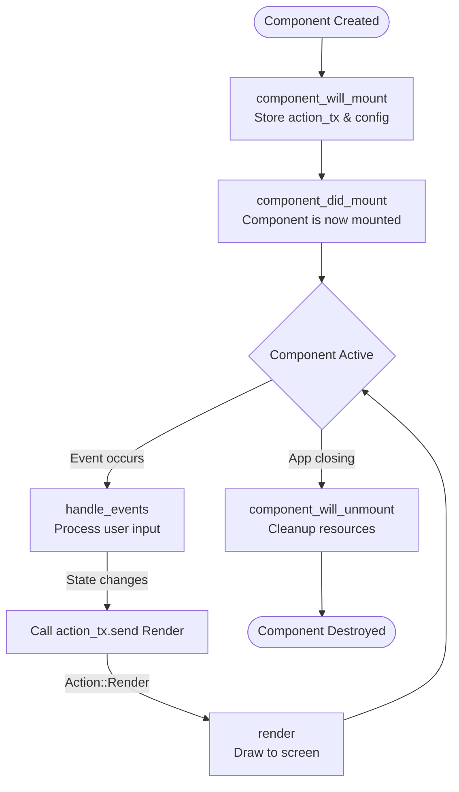

# yap

[](https://github.com//ratatui-hello-world/actions)

A React-like TUI framework built with Ratatui, featuring component lifecycle, children composition, and event-driven rendering.

## Component Lifecycle

This framework implements a React-like component lifecycle with the following phases:

### Lifecycle Methods

```rust
pub trait Component {
    // 1. Component Will Mount - called once when component is created, before mounting
    fn component_will_mount(&mut self, tx: UnboundedSender<Action>, config: Config) -> Result<()>
    
    // 2. Component Did Mount - called after component is mounted
    fn component_did_mount(&mut self, area: Size) -> Result<()>
    
    // 3. Handle Events - called when events occur
    fn handle_events(&mut self, event: Option<Event>) -> Result<Option<Action>>
    
    // 4. Render - called when Action::Render is received
    fn render(&mut self, frame: &mut Frame, area: Rect) -> Result<()>
    
    // 5. Component Will Unmount - called before component is destroyed
    fn component_will_unmount(&mut self) -> Result<()>
}
```

### Lifecycle Flow



### setState Pattern

Components trigger re-renders by sending `Action::Render` when state changes:

```rust
pub struct Counter {
    count: i32,
    action_tx: Option<UnboundedSender<Action>>,
}

impl Counter {
    fn set_count(&mut self, new_count: i32) {
        self.count = new_count;
        // Trigger re-render when state changes
        if let Some(tx) = &self.action_tx {
            let _ = tx.send(Action::Render);
        }
    }
}

impl Component for Counter {
    fn component_will_mount(&mut self, tx: UnboundedSender<Action>, _config: Config) -> Result<()> {
        self.action_tx = Some(tx); // Store for setState
        Ok(())
    }
    
    fn handle_key_event(&mut self, key: KeyEvent) -> Result<Option<Action>> {
        match key.code {
            KeyCode::Char('h') => self.set_count(self.count + 1), // setState pattern
            KeyCode::Char('e') => self.set_count(self.count - 1),
            _ => {}
        }
        Ok(None)
    }
}
```

### Children Composition

Components can contain children, similar to React:

```rust
let mut container = Container::new("My Container");
container.with_children(vec![
    Box::new(Home::new()),
    Box::new(Counter::default()),
]);
```

Children receive lifecycle events automatically through helper methods:
- `init_children()` - Initialize children in component_will_mount
- `mount_children()` - Mount children in component_did_mount
- `propagate_events()` - Pass events to children in handle_events
- `unmount_children()` - Cleanup children in component_will_unmount

### Event-Driven Rendering

**No tick rate or frame rate** - rendering only occurs when:
1. Initial mount (`app.rs:66`)
2. Component calls `action_tx.send(Action::Render)` (setState pattern)
3. Window resize (`app.rs:156`)
4. Resume from suspend (`app.rs:87`)

This makes the framework efficient - the UI only updates when state actually changes.
